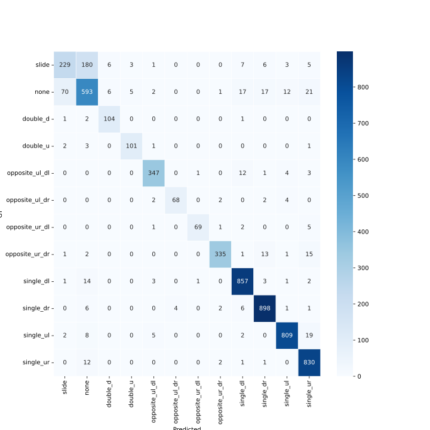
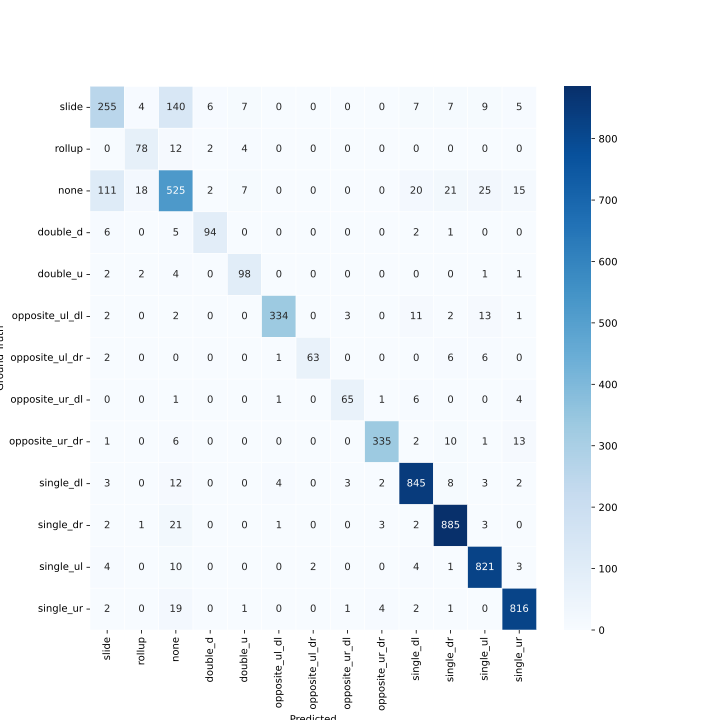
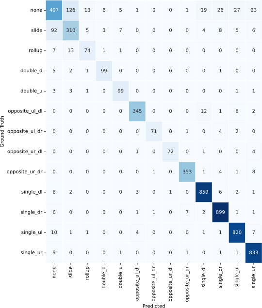
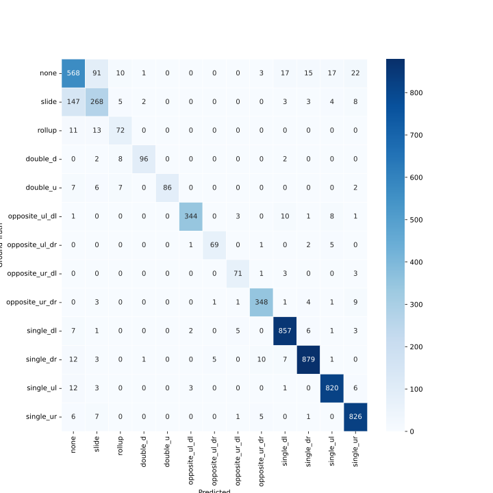

# Baseline - MNIST ConvNet https://keras.io/examples/vision/mnist_convnet/

This simple network achieves 99% accuracy on the MNIST dataset

Trained for 45 minutes (30 epochs), best epoch was 8:

val_loss = 0.424
val_acc = 0.878

Test: 5738 examples (181 batches of 32) - 11.1s
[{'test_loss': 0.3701358437538147, 'test_acc': 0.8924433588981628}]

class,slide,none,double_d,double_u,opposite_ul_dl,opposite_ul_dr,opposite_ur_dl,opposite_ur_dr,single_dl,single_dr,single_ul,single_ur
accuracy,48.64,80.38,88.89,89.81,88.86,79.49,78.21,92.39,95.46,96.30,97.16,96.81
precision:72.79,67.57,92.31,90.65,98.20,98.41,92.42,98.55,92.94,94.14,93.30,95.12

# ConvNext as a fixed feature extractor with single FC layer after

Trained for 1:03 hours (38 epochs), best epoch was 17:

val_loss = 0.8425
val_acc = 0.7524

Test: 5738 examples (181 batches of 32) - 14.7s
[{'test_loss': 0.7988953590393066, 'test_acc': 0.7527235150337219}]

class,slide,none,double_d,double_u,opposite_ul_dl,opposite_ul_dr,opposite_ur_dl,opposite_ur_dr,single_dl,single_dr,single_ul,single_ur
accuracy,58.64,59.54,55.56,59.26,82.07,61.54,55.13,80.71,79.02,79.30,83.31,83.81
precision,46.57,62.66,66.67,68.82,78.44,87.27,81.13,86.59,81.52,82.45,79.10,81.03

Tried unfreezing after training last layer, did not work (loss blew up and accuracy dropped to 5%)

#  ConvNext trained end-to-end not pretrained

Trained for 1:15 hours (25 epochs), best epoch was 3:

val_loss = 0.428
val_acc = 0.876

Test: 5738 examples (181 batches of 32) - 15.8s
[{'test_loss': 0.39645376801490784, 'test_acc': 0.883451521396637}]

class,slide,none,double_d,double_u,opposite_ul_dl,opposite_ul_dr,opposite_ur_dl,opposite_ur_dr,single_dl,single_dr,single_ul,single_ur
accuracy,45.45,78.49,90.74,89.81,89.40,78.21,83.33,89.40,96.26,94.55,94.67,96.45
precision,74.07,68.46,83.76,86.61,95.09,91.04,91.55,96.48,91.29,93.94,92.38,92.10

# ConvNext trained end-to-end but pretrained

Trained for 45 minutes (15 epochs), best epoch was 3:

val_loss = 0.339
val_acc = 0.905

Test: 5738 examples (181 batches of 32) - 15.3s
[{'test_loss': 0.30935680866241455, 'test_acc': 0.9061040878295898}]

class,slide,none,double_d,double_u,opposite_ul_dl,opposite_ul_dr,opposite_ur_dl,opposite_ur_dr,single_dl,single_dr,single_ul,single_ur
accuracy,52.05,79.70,96.30,93.52,94.29,87.18,88.46,91.03,97.17,97.82,95.74,98.11
precision,74.84,72.32,89.66,92.66,95.86,94.44,97.18,97.67,94.59,95.43,96.89,92.02

# MNIST network

Trained for 40 minutes (24 epochs), best epoch was 8:

val_loss = 0.436
val_acc = 0.871

Test: 5879 examples (184 batches of 32) - 11.4s
[{'test_loss': 0.3676840364933014, 'test_acc': 0.8868855237960815}]

class,none,slide,rollup,double_d,double_u,opposite_ul_dl,opposite_ul_dr,opposite_ur_dl,opposite_ur_dr,single_dl,single_dr,single_ul,single_ur
accuracy,70.56,57.95,81.25,87.04,90.74,90.76,80.77,83.33,91.03,95.80,96.41,97.16,96.45
precision,69.35,65.38,75.73,90.38,83.76,97.95,96.92,90.28,97.10,93.78,93.95,93.08,94.88

# ConvNeXt trained end-to-end single FC layer all classes

Trained for 36 minutes (14 epochs), best epoch was 5:

val_loss = 0.334
val_acc = 0.909

Test: 5879 examples (184 batches of 32) - 14.2s
[{'test_loss': 0.3125835955142975, 'test_acc': 0.9067868590354919}]

class,none,slide,rollup,none,double_d,double_u,opposite_ul_dl,opposite_ul_dr,opposite_ur_dl,opposite_ur_dr,single_dl,single_dr,single_ul,single_ur
accuracy,66.80,70.45,77.08,91.67,91.67,93.75,91.03,92.31,95.92,97.39,97.93,97.04,98.46
precision,78.02,67.83,77.89,90.83,87.61,97.18,97.26,98.63,97.25,95.55,94.53,94.47,94.02

# EfficientNetV2-S trained end-to-end single FC layer all classes

Trained for 30 minutes (24 epochs), best epoch was 1:

val_loss = 0.387
val_acc = 0.893

Test: 5879 examples (184 batches of 32) - 17.3s
[{'test_loss': 0.29978010058403015, 'test_acc': 0.9021942615509033}]

class,none,slide,rollup,double_d,double_u,opposite_ul_dl,opposite_ul_dr,opposite_ur_dl,opposite_ur_dr,single_dl,single_dr,single_ul,single_ur
accuracy,76.34,60.91,75.00,88.89,79.63,93.48,88.46,91.03,94.57,97.17,95.75,97.04,97.64
precision,73.67,67.51,70.59,96.00,100.00,98.29,92.00,87.65,94.57,95.12,96.49,95.68,93.86
